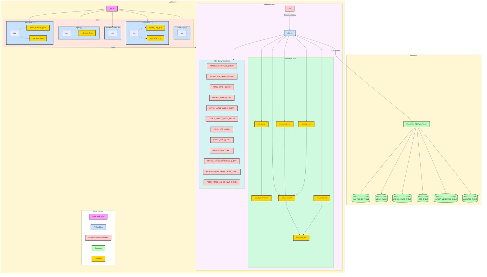

# Wastewater Data Validation App 

[](https://posit-connect-dv.phac-aspc.gc.ca/wastewater-KeyMetrics/) [](https://www.python.org/downloads/)

A Streamlit-based dashboard for monitoring, analyzing, and modifying wastewater measurements data. Changes to this app are currently set to continously deploy to an instance hosted on Posit Connect.


## 🚀 Features

- 🚰 View and impute CovN2, RSV, FluA, and FluB trend data
- 🦠 View and impute Mpox trend data
- 🆕 View the 2 most recent measures from any wastewater site
- ⚠️ View recorded measures with unusually large jumps in values 

## 🏗️ Architecture

```
wastewater-trends-streamlit/
├── app.py                    # Main application entry
├── views/                    # Page components
│   ├── large-jumps.py        # Handles the "Large Jumps" page
│   ├── latest-measures.py    # Handles the "Latest Measures" page
│   ├── mpox.py               # Handles the "Mpox Trends" page
│   ├── ww-trends.py          # Handles the "Wastewater Trends" page
├── utils.py                  # Shared util functions
├── .env                      # Environment configuration
└── requirements.txt          # Dependencies
```




## 🛠️ Installation

```bash
git clone https://github.com/PHACDataHub/wastewater-trends-streamlit.git
cd wastewater-trends-streamlit
python -m venv .venv
source .venv/bin/activate # If on Linux
.venv\Scripts\activate # If on Windows
pip install -r requirements.txt
```
## 🔧 Configuration

Create a `.env` file in the project root:


```ini
# These values are available through ADB workspace
ADB_INSTANCE_NAME = ""
ADB_HTTP_PATH = ""
ADB_API_KEY = ""

# The names of the catalog tables used within each of the pages
WW_TRENDS_TABLE = ""
MPOX_TABLE = ""
LARGE_JUMPS_TABLE = ""
LOGS_TABLE = ""
LATEST_MEASURES_TABLE = ""
ALLSITES_TABLE = ""

# The job id of the jobs used to push data from ADB catalog to prod blob
WW_JOB_ID = ""
MPOX_JOB_ID = ""

DEVELOPMENT = "TRUE" # Only add this value in your dev environment
```

## 📈 Usage

`streamlit run app.py`

## 🔍 Troubleshooting

#### Common issues:

1. **Cold Cluster Startup:**  
   The first data load may take up to 5 minutes if the data cluster is cold. Please allow extra time on startup.

2. **Configuration Errors:**  
   - Ensure your `.env` file is set up correctly with the proper values for `ADB_INSTANCE_NAME`, `ADB_HTTP_PATH`, and `ADB_API_KEY`.  
   - Verify that the table names in the `.env` (e.g. `WW_TRENDS_TABLE`, `MPOX_TABLE`, etc.) are correct.

3. **Permission Issues:**  
   If you cannot modify data or load certain pages, check your permissions. In development mode, The `DEVELOPMENT` flag should be added to your `.env`.
