# Application Architecture Overview

## Visual Diagram

```mermaid
---
config:
  layout: elk
  elk:
    mergeEdges: true
    nodePlacementStrategy: SIMPLE
---
graph
    subgraph "Database"
        style Database fill:#fff6d4

        I[Databricks SQL Warehouse]
        J[(WW_TRENDS_TABLE)]
        K[(MPOX_TABLE)]
        L[(LARGE_JUMPS_TABLE)]
        M[(LOGS_TABLE)]
        N[(LATEST_MEASURES_TABLE)]
        O[(ALLSITES_TABLE)]
    end

    subgraph "Application"
    style Application fill:#fff6d4
        A[app.py]
        
        subgraph "Views"
            style Views fill:#e6dcd1

            subgraph B["ww-trends.py"]
                app_ww[app]
                app_ww --> create_sunburst_graph
                app_ww --> edit_data_form_ww
                app_ww --> get_missing_PT
            end

            subgraph C["mpox.py"]
                app_mpox[app]
                app_mpox --> edit_data_form_mpox
            end

            subgraph D["latest-measures.py"]
                app_latest_measures[app]
            end

            subgraph E["large-jumps.py"]
                app_large_jumps[app]
                app_large_jumps --> create_jump_plot
                app_large_jumps --> edit_data_form_large_jumps
            end

            subgraph F["admin-page.py"]
                app_admin[app]
            end
        end

        subgraph shared_utilities["Shared Utilities"]
            style shared_utilities fill:#fcf0ff
            G[utils.py]
            H[.env]
            
            subgraph core_functions["Core Functions"]
                style core_functions fill:#c1e3c1
                get_db_connection[get_db_connection]
                get_cursor[get_cursor]
                trigger_job_run[trigger_job_run]
                get_user_info[get_user_info]
                get_username[get_username]
                can_user_edit[can_user_edit]
                get_log_entry[get_log_entry]
            end

            subgraph sql_query_templates["SQL Query Templates"]
                style sql_query_templates fill:#d5f2f5

                select_ww_data[FETCH_WW_TRENDS_QUERY]
                update_ww[UPDATE_WW_TRENDS_QUERY]
                select_mpox_data[FETCH_MPOX_QUERY]
                update_mpox[UPDATE_MPOX_QUERY]
                select_jumps_data[FETCH_LARGE_JUMPS_QUERY]
                update_jumps[UPDATE_LARGE_JUMPS_QUERY]
                select_logs[FETCH_LOG_QUERY]
                insert_log[INSERT_LOG_QUERY]
                delete_log[DELETE_LOG_QUERY]
                select_latest[FETCH_LATEST_MEASURES_QUERY]
                select_before_jump[FETCH_BEFORE_LARGE_JUMP_QUERY]
                select_after_jump[FETCH_AFTER_LARGE_JUMP_QUERY]
            end
        end

        %% Connections
        A --> B & C & D & E & F
        Views -->|Uses| shared_utilities
        G --> sql_query_templates
        
        G --> get_cursor
        get_cursor --> get_db_connection
        G --> trigger_job_run
        G --> get_username
        G --> can_user_edit
        G --> get_log_entry
        H -->|Secret Variables| G
        get_db_connection -->|SQL Queries| I
        I --> J & K & L & M & N & O
        trigger_job_run --> get_username
        get_username --> get_user_info
        can_user_edit --> get_user_info
        get_log_entry --> get_username

        %% Feature Nodes
        create_sunburst_graph[create_sunburst_graph]
        get_missing_PT[get_missing_PT]
        edit_data_form_ww[edit_data_form]
        edit_data_form_mpox[edit_data_form]
        create_jump_plot[create_jump_plot]
        edit_data_form_large_jumps[edit_data_form]

        %% Legend
        subgraph Legend
        style Legend fill:#ffffff
            z1[Application Root]
            z2[Python Files]
            z3[Defined Constant Variables]
            z4[Database]
            z5[Functions]
        end

        %% Component descriptions
        classDef main fill:#f9f,stroke:#333,stroke-width:2px
        classDef views fill:#c6e2ff,stroke:#333,stroke-width:2px
        classDef consts fill:#ffcccb,stroke:#333,stroke-width:2px
        classDef db fill:#bfb,stroke:#333,stroke-width:2px
        classDef function fill:#ffd700,stroke:#333,stroke-width:2px
        classDef subgraphStyle font-size:25px;

        class A,z1 main
        class B,C,D,E,F,G,z2 views
        class H,select_ww_data,update_ww,select_mpox_data,update_mpox,select_jumps_data,update_jumps,select_logs,insert_log,delete_log,select_latest,select_before_jump,select_after_jump,z3 consts
        class I,J,K,L,M,N,O,z4 db
        class app_ww,app_mpox,app_latest_measures,app_admin,app_large_jumps,create_sunburst_graph,get_missing_PT,edit_data_form_ww,edit_data_form_mpox,create_jump_plot,edit_data_form_large_jumps,get_db_connection,get_cursor,trigger_job_run,get_user_info,get_username,can_user_edit,get_log_entry,z5 function
        class Application,shared_utilities,Database subgraphStyle
    end
```

## Core Components

1.  **Main Application (`app.py`)**

    *   Entry point that sets up navigation between different views.
    *   Uses Streamlit's page system (`st.navigation`) to manage multiple views, each defined as a separate Python file.

2.  **View Pages**

    *   [`ww-trends.py`](views/ww-trends.py): Respiratory virus trends visualization with sunburst graphs.
        *   Uses `create_sunburst_graph()` to display viral activity levels by region.
        *   Implements `edit_data_form_ww()` (a Streamlit dialog) for editing and submitting data.
        *   Uses `get_missing_PT()` to check if any of the PTs are missing or if Canada is missing from data.
    *   [`mpox.py`](views/mpox.py): Mpox trends data management.
        *   Implements `edit_data_form_mpox()` (a Streamlit dialog) for editing and submitting data.
    *   [`latest-measures.py`](views/latest-measures.py): Display of measures from within the last 30 days.
    *   [`large-jumps.py`](views/large-jumps.py): Display of anomalous measures (difference between log(`latestObs`) 
    and log(`previousObs`) is > 1 or `latestObs` is > historical maximum recorded for a site and measure) 
    detected from the last 30 days.
        *   Uses `create_jump_plot()` to visualize large jumps in measurements over time.
        *   Implements `edit_data_form_large_jumps()` (a Streamlit dialog) for editing and submitting data.
    *   [`admin-page.py`](views/admin-page.py): Page displaying list of user action logs.

3.  **Utilities (`utils.py`)**

    *   Core database functions: [`get_db_connection()`](utils.py), [`get_cursor()`](utils.py).
    *   User management: [`get_user_info()`](utils.py), [`get_username()`](utils.py), [`can_user_edit()`](utils.py).
    *   Job management: [`trigger_job_run()`](utils.py).
    *   Logging: [`get_log_entry()`](utils.py).
    *   SQL query templates for all database operations:
        *   `FETCH_WW_TRENDS_QUERY`, `UPDATE_WW_TRENDS_QUERY` (for `WW_TRENDS_TABLE`).
        *   `FETCH_MPOX_QUERY`, `UPDATE_MPOX_QUERY` (for `MPOX_TABLE`).
        *   `FETCH_LARGE_JUMPS_QUERY`, `UPDATE_LARGE_JUMPS_QUERY` (for `LARGE_JUMPS_TABLE`).
        *   `FETCH_LOG_QUERY`, `INSERT_LOG_QUERY`, `DELETE_LOG_QUERY` (for `LOGS_TABLE`).
        *   `FETCH_LATEST_MEASURES_QUERY` (for `LATEST_MEASURES_TABLE`).
        *   `FETCH_BEFORE_LARGE_JUMP_QUERY`, `FETCH_AFTER_LARGE_JUMP_QUERY` (for `ALLSITES_TABLE`).

4.  **Database Layer**

    *   Databricks SQL Warehouse containing tables:
        *   `WW_TRENDS_TABLE`: Wastewater trends data.
        *   `MPOX_TABLE`: Mpox surveillance data.
        *   `LARGE_JUMPS_TABLE`: Anomaly detection records.
        *   `LOGS_TABLE`: Audit logging.
        *   `LATEST_MEASURES_TABLE`: Recent measurements.
        *   `ALLSITES_TABLE`: Site reference data, used for historical data in large jump plots.

## Data Flow
*   The user navigates to a specific page in the Streamlit application (e.g., Wastewater Trends, Mpox Trends).
*   The application loads data for the selected page from the Databricks SQL Warehouse, using queries defined in [`utils.py`](utils.py) (e.g., [`FETCH_WW_TRENDS_QUERY`](utils.py), [`FETCH_MPOX_QUERY`](utils.py), [`FETCH_LARGE_JUMPS_QUERY`](utils.py)).
*   The user views the data in a Streamlit dataframe. If the user has edit permissions ([`can_user_edit()`](utils.py)), they can select one or more rows for editing.
*   The user modifies the data using the `edit_data_form` dialog pop-up.
*   Upon submission, the application updates the corresponding table in the Databricks SQL Warehouse, using queries like [`UPDATE_WW_TRENDS_QUERY`](utils.py), [`UPDATE_MPOX_QUERY`](utils.py), or [`UPDATE_LARGE_JUMPS_QUERY`](utils.py).
*   The application logs the changes using [`get_log_entry()`](utils.py) and [`INSERT_LOG_QUERY`](utils.py).
*   The application triggers a Databricks job (using [`trigger_job_run()`](utils.py)) to sync the changes with the main MSSQL database and blob-storage CSV files. The specific job ID is determined by the page (e.g., `WW_JOB_ID` or `MPOX_JOB_ID` from the environment variables).
*   The Databricks job also sends a GC-Notify email to the user, confirming that their changes were successfully applied.
