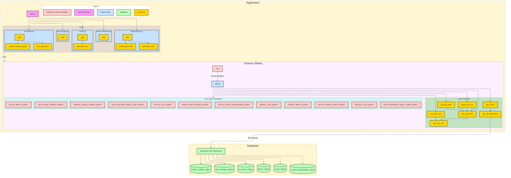

```mermaid
---
config:
  layout: elk
  elk:
    mergeEdges: true
    nodePlacementStrategy: SIMPLE
---
graph
    subgraph "Database"
        style Database fill:#fff6d4

        I[Databricks SQL Warehouse]
        J[(WW_TRENDS_TABLE)]
        K[(MPOX_TABLE)]
        L[(LARGE_JUMPS_TABLE)]
        M[(LOGS_TABLE)]
        N[(LATEST_MEASURES_TABLE)]
        O[(ALLSITES_TABLE)]
    end

    subgraph "Application"
    style Application fill:#fff6d4
        A[app.py]
        
        subgraph "Views"
            style Views fill:#e6dcd1

            subgraph B["ww-trends.py"]
                app_ww[app]
                app_ww --> create_sunburst_graph
                app_ww --> edit_data_form_ww
            end

            subgraph C["mpox.py"]
                app_mpox[app]
                app_mpox --> edit_data_form_mpox
            end

            subgraph D["latest-measures.py"]
                app_latest_measures[app]
            end

            subgraph E["large-jumps.py"]
                app_large_jumps[app]
                app_large_jumps --> create_jump_plot
                app_large_jumps --> edit_data_form_large_jumps
            end

            subgraph F["admin-page.py"]
                app_admin[app]
            end
        end

        subgraph shared_utilities["Shared Utilities"]
            style shared_utilities fill:#fcf0ff
            G[utils.py]
            H[.env]
            
            subgraph core_functions["Core Functions"]
                style core_functions fill:#c1e3c1
                get_db_connection[get_db_connection]
                get_cursor[get_cursor]
                trigger_job_run[trigger_job_run]
                get_user_info[get_user_info]
                get_username[get_username]
                can_user_edit[can_user_edit]
                get_log_entry[get_log_entry]
            end

            subgraph sql_query_templates["SQL Query Templates"]
                style sql_query_templates fill:#d5f2f5

                select_ww_data[FETCH_WW_TRENDS_QUERY]
                update_ww[UPDATE_WW_TRENDS_QUERY]
                select_mpox_data[FETCH_MPOX_QUERY]
                update_mpox[UPDATE_MPOX_QUERY]
                select_jumps_data[FETCH_LARGE_JUMPS_QUERY]
                update_jumps[UPDATE_LARGE_JUMPS_QUERY]
                select_logs[FETCH_LOG_QUERY]
                insert_log[INSERT_LOG_QUERY]
                delete_log[DELETE_LOG_QUERY]
                select_latest[FETCH_LATEST_MEASURES_QUERY]
                select_before_jump[FETCH_BEFORE_LARGE_JUMP_QUERY]
                select_after_jump[FETCH_AFTER_LARGE_JUMP_QUERY]
            end
        end

        %% Connections
        A --> B & C & D & E & F
        Views -->|Uses| shared_utilities
        G --> sql_query_templates
        
        G --> get_cursor
        get_cursor --> get_db_connection
        G --> trigger_job_run
        G --> get_username
        G --> can_user_edit
        G --> get_log_entry
        H -->|Secret Variables| G
        get_db_connection -->|SQL Queries| I
        I --> J & K & L & M & N & O
        trigger_job_run --> get_username
        get_username --> get_user_info
        can_user_edit --> get_user_info
        get_log_entry --> get_username

        %% Feature Nodes
        create_sunburst_graph[create_sunburst_graph]
        edit_data_form_ww[edit_data_form]
        edit_data_form_mpox[edit_data_form]
        create_jump_plot[create_jump_plot]
        edit_data_form_large_jumps[edit_data_form]

        %% Legend
        subgraph Legend
        style Legend fill:#ffffff
            z1[Application Root]
            z2[Python Files]
            z3[Defined Constant Variables]
            z4[Database]
            z5[Functions]
        end

        %% Component descriptions
        classDef main fill:#f9f,stroke:#333,stroke-width:2px
        classDef views fill:#c6e2ff,stroke:#333,stroke-width:2px
        classDef consts fill:#ffcccb,stroke:#333,stroke-width:2px
        classDef db fill:#bfb,stroke:#333,stroke-width:2px
        classDef function fill:#ffd700,stroke:#333,stroke-width:2px
        classDef subgraphStyle font-size:25px;

        class A,z1 main
        class B,C,D,E,F,G,z2 views
        class H,select_ww_data,update_ww,select_mpox_data,update_mpox,select_jumps_data,update_jumps,select_logs,insert_log,delete_log,select_latest,select_before_jump,select_after_jump,z3 consts
        class I,J,K,L,M,N,O,z4 db
        class app_ww,app_mpox,app_latest_measures,app_admin,app_large_jumps,create_sunburst_graph,edit_data_form_ww,edit_data_form_mpox,create_jump_plot,edit_data_form_large_jumps,get_db_connection,get_cursor,trigger_job_run,get_user_info,get_username,can_user_edit,get_log_entry,z5 function
        class Application,shared_utilities,Database subgraphStyle
    end
```